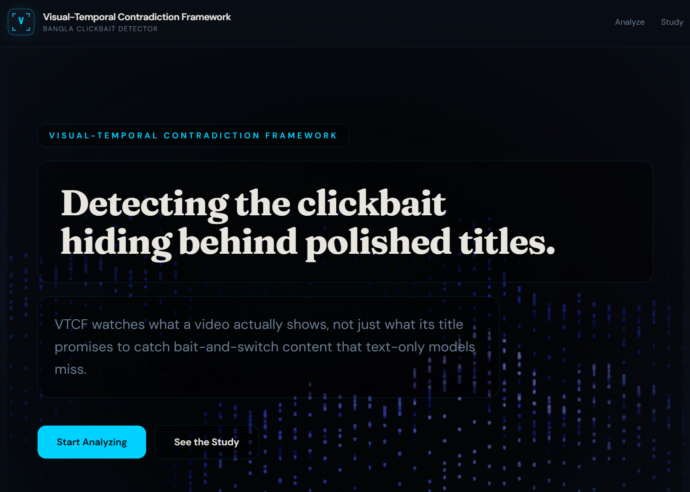
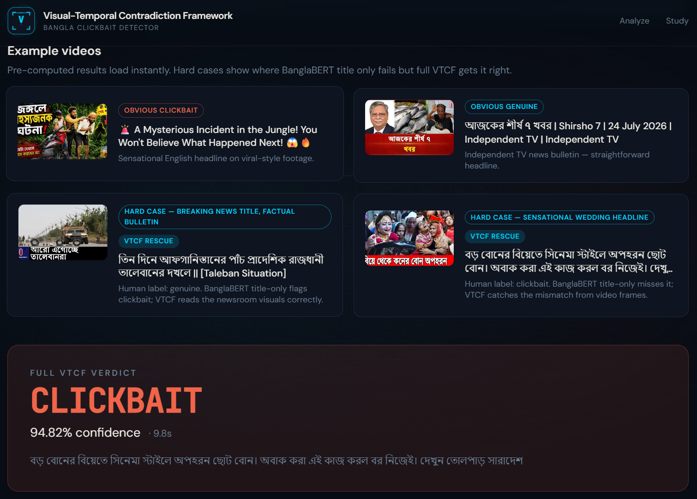
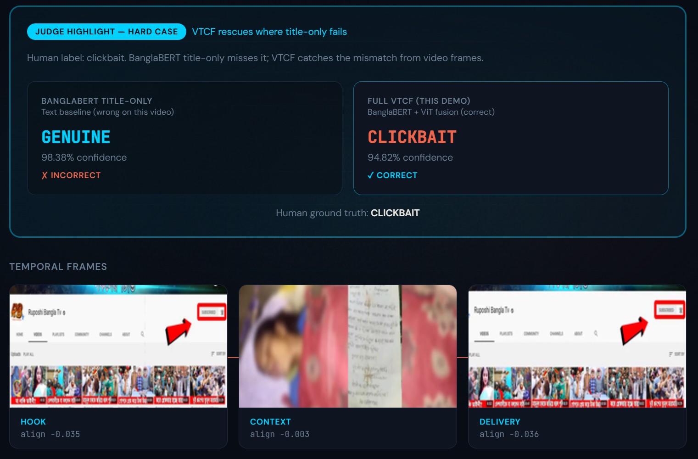
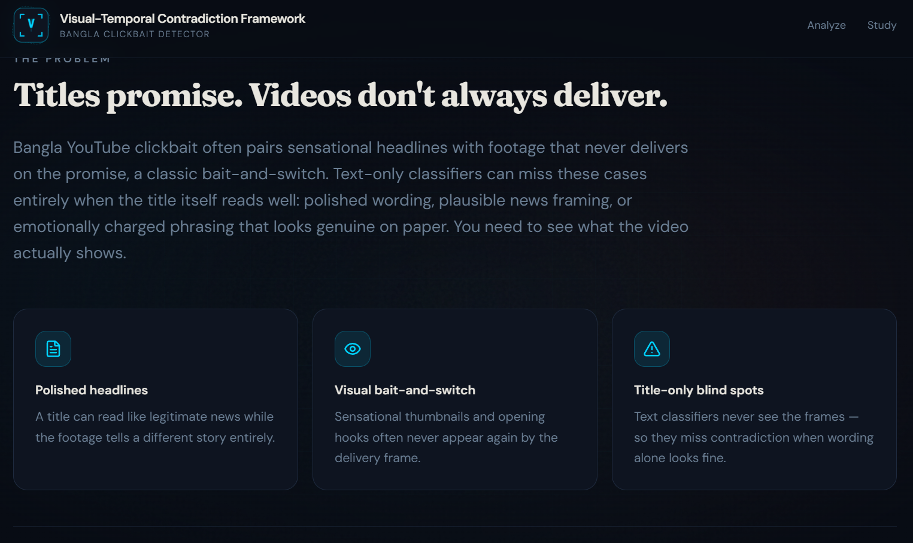
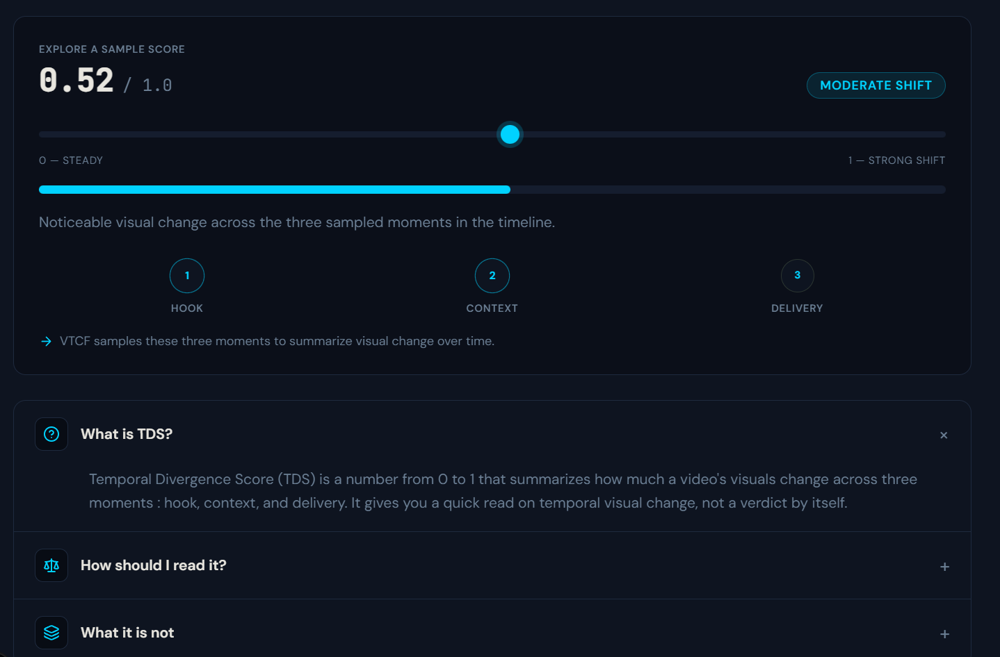

# VTCF — Bangla YouTube Clickbait Detector

**Hackathon demo** for the [Visual-Temporal Contradiction Framework (VTCF)](https://github.com/KraKEn-bit/Multi-Modal-Clickbait-Analysis): a multimodal system that flags Bangla YouTube clickbait by comparing what the **title promises** with what the **video actually shows** — not title text alone.

> **For judges:** This is a working web app. Start the backend + frontend (5-minute setup below), open `http://localhost:3000`, and click any **Example video** card for instant results — no YouTube download required. The two **VTCF RESCUE** hard cases are the headline demo.

Part of: [Multi-Modal Clickbait Analysis](https://github.com/KraKEn-bit/Multi-Modal-Clickbait-Analysis)

---

## What problem does this solve?

Bangla YouTube clickbait often uses polished or sensational **headlines** while the **footage** tells a different story. Text-only classifiers (even strong ones like BanglaBERT) can miss this when the title alone looks legitimate.

**VTCF fuses:**
1. **Title text** — BanglaBERT reads the headline's promise  
2. **Visual frames** — ViT reads hook, context, and delivery moments  
3. **Cross-modal fusion** — cross-attention compares title against visuals to catch contradictions text alone misses  



---

## Demo walkthrough (recommended for judges)

| Step | What to do | What you'll see |
|------|------------|-----------------|
| **1** | Open the landing page | Hero + scroll to **Example videos** |
| **2** | Click **Hard case — sensational wedding headline** (bottom-right, `VTCF RESCUE`) | Full pipeline result in ~1 s (pre-cached) |
| **3** | Scroll to **Judge Highlight — hard case** | Side-by-side: BanglaBERT title-only **wrong** vs Full VTCF **correct** |
| **4** | Review **Temporal frames** (Hook → Context → Delivery) | The visual evidence behind the verdict |
| **5** | (Optional) Paste a YouTube URL and click **Analyze live** | Live download + inference (~45–90 s; needs cookies/checkpoints) |





---

## Why text-only fails (the Study motivation)



| Stat | Result |
|------|--------|
| **Full VTCF F1** | **99.63%** on 8,047 human-labeled Bangla YouTube videos |
| **Hard-case rescue** | **100% vs 64%** — Full VTCF vs speech/summary title-only on 33 hardest failures |
| **Text-only F1** | 90.4% — misses visual bait-and-switch |

---

## Temporal Divergence Score (TDS)

TDS (0–1) summarizes how much a video's **visuals change** across hook, context, and delivery. It is shown alongside frames and explanations — **not a verdict by itself**.

**Research surprise:** clickbait videos average **lower** TDS (~0.38) than genuine news (~0.64) — clickbait often reuses static footage rather than visually switching mid-video.



---

## Quick start (run locally)

### Prerequisites

- Python 3.11+ · Node.js 18+ · [ffmpeg](https://ffmpeg.org/) on PATH  
- Clone the **full parent repo** (not just `App/`):

```bash
git clone https://github.com/KraKEn-bit/Multi-Modal-Clickbait-Analysis.git
cd Multi-Modal-Clickbait-Analysis
```

**Link research code** (required once — app imports `../vtcf-research`):

```powershell
# Windows
mklink /J vtcf-research VTCF-Finding-1
```

```bash
# macOS / Linux
ln -s VTCF-Finding-1 vtcf-research
```

**Model checkpoints (~2–3 GB, not in GitHub):** place trained weights at  
`vtcf-research/outputs/checkpoints/best_model_full.pt`  
(or train via [VTCF-Finding-1](../VTCF-Finding-1/readme.md)).  
**Pre-cached example cards work without checkpoints.**

### Terminal 1 — Backend

```powershell
cd App\backend
python -m venv .venv
.venv\Scripts\activate          # macOS/Linux: source .venv/bin/activate
pip install -r requirements.txt
python -m uvicorn main:app --host 127.0.0.1 --port 8000
```

### Terminal 2 — Frontend

```powershell
cd App\frontend
npm install
npm run dev
```

Open **http://localhost:3000**

Verify API: `curl http://127.0.0.1:8000/health` → `{"status":"ok"}`

---

## Tech stack

| Layer | Stack |
|-------|-------|
| Text | BanglaBERT (`sagorsarker/bangla-bert-base`) |
| Vision | ViT (`google/vit-base-patch16-224`) |
| ML | PyTorch, Hugging Face Transformers |
| Video | yt-dlp, PySceneDetect, OpenCV, ffmpeg |
| Backend | FastAPI, Uvicorn |
| Frontend | Next.js 16, React 19, Tailwind CSS 4, Framer Motion |

---

## API endpoints

| Method | Path | Description |
|--------|------|-------------|
| `GET` | `/health` | Liveness |
| `GET` | `/examples` | 4 pre-cached demo videos (instant UI) |
| `POST` | `/analyze` | `{ "youtube_url": "..." }` — full pipeline |

---

## Cached demo videos

| Video | Label | Why it matters |
|-------|-------|----------------|
| `pYganyZsHYM` | Obvious clickbait | Sensational English headline |
| `hcFpC8R6c24` | Obvious genuine | Independent TV news bulletin |
| `OoUO4vjgM4c` | Hard / **VTCF rescue** | BanglaBERT → clickbait; VTCF → genuine (newsroom visuals) |
| `DhESX8gA7wk` | Hard / **VTCF rescue** | BanglaBERT → genuine; VTCF → clickbait (frame mismatch) |

---

## Limitations (honest)

**Finding-1 (this demo):**
- Checkpoints and full 8k-frame cache not shipped (~GB scale)
- Live YouTube analysis may fail without browser cookies
- Three-frame sample — not full-video understanding
- Trained on Bangla YouTube news-style content

**Finding-2 (speech/OCR extension, referenced in hard-case stats):**
- Fusion trained on **1,591 of 8,047** videos — remainder blocked by Gemini API rate limits / incomplete ASR
- Hook OCR sparse on Bangla news thumbnails
- Semantic divergence (title vs summary) not used as classifier

---

## Project layout

```
App/
├── backend/              FastAPI + VTCF inference wrapper
│   └── cached_examples/  Pre-computed JSON + frame PNGs (demo works offline)
├── frontend/             Next.js demo UI
├── docs/screenshots/     Screenshots for this README
└── README.md
```

---

## Related research

- [VTCF Finding-1](../VTCF-Finding-1/) — visual-text baseline, ablations, TDS analysis  
- [VTCF Finding-2](../VTCF-finding-2/) — Bangla ASR + OCR + LLM summary fusion  

Human labels from **BaitBuster-Bangla**. Demo not affiliated with YouTube.

---

## Troubleshooting

| Issue | Fix |
|-------|-----|
| Example cards won't load | Start backend on port 8000 |
| `best_model_full.pt` not found | Only affects live URL analysis; use cached examples |
| `vtcf-research` not found | Create symlink to `VTCF-Finding-1` (see Quick start) |
| Slow first run | Hugging Face downloads models on first inference |
