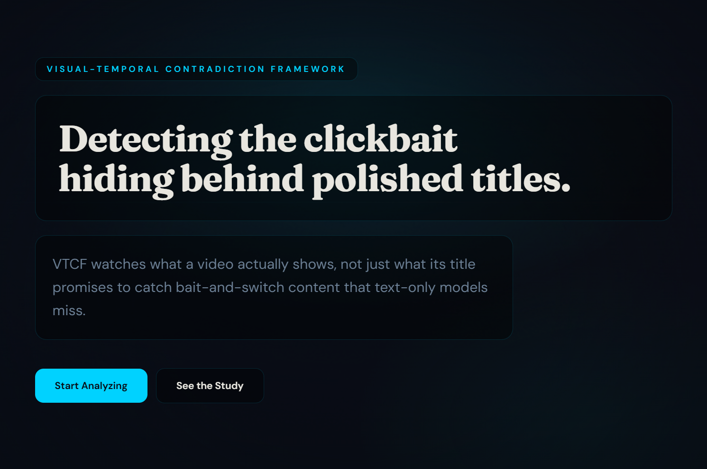
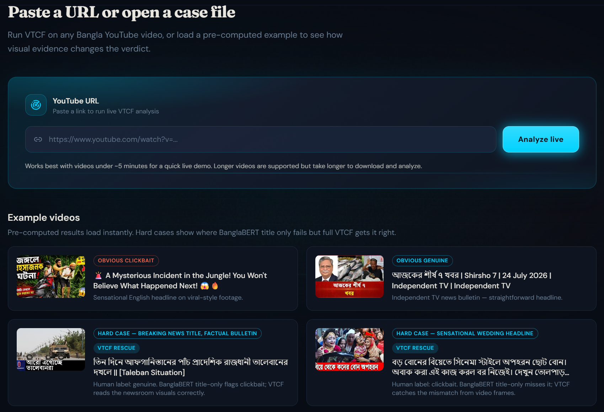
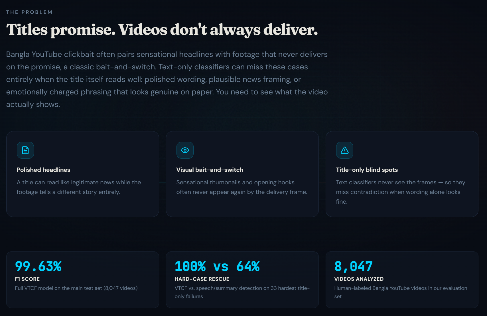
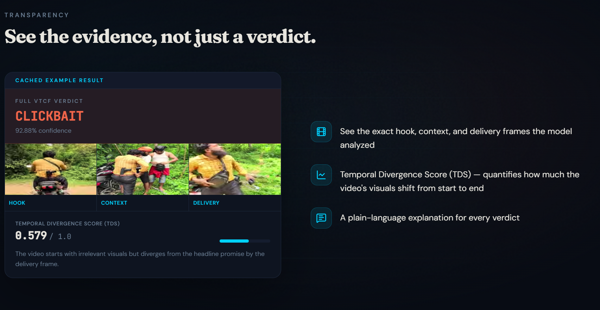
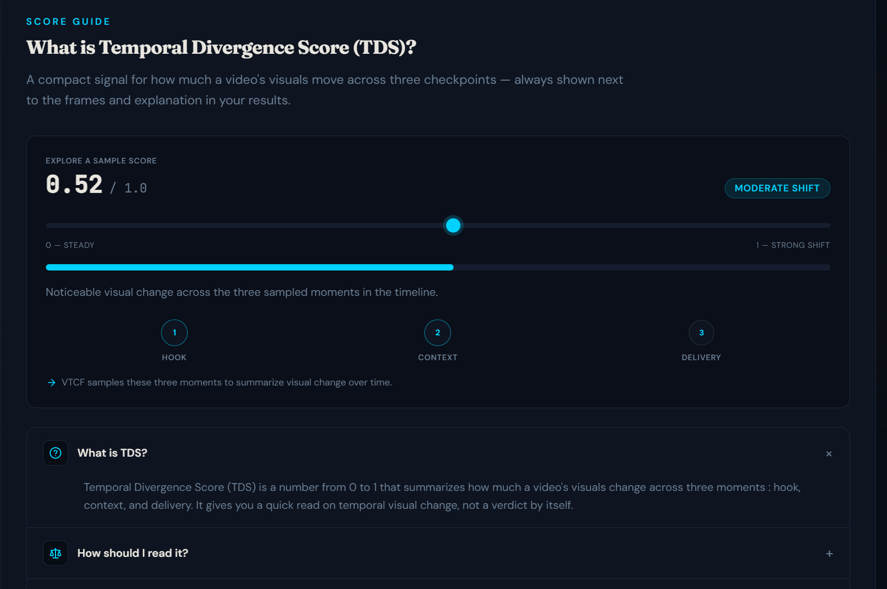

# VTCF — Bangla YouTube Clickbait Detector (App Version 1)

**Hackathon demo** for the [Visual-Temporal Contradiction Framework (VTCF)](https://github.com/KraKEn-bit/Multi-Modal-Clickbait-Analysis): a multimodal system that flags Bangla YouTube clickbait by comparing what the **title promises** with what the **video actually shows** — not title text alone.

> **This branch (`main`)** is the **original landing UI** (hero, problem section, example cards, live analyze).  
> For the dark agent UI, see branch [`App_Version_2`](https://github.com/KraKEn-bit/Multi-Modal-Clickbait-Analysis/tree/App_Version_2/App).

> **For judges:** Start the backend + frontend (setup below), open `http://localhost:3000`, and click the **Hard case — breaking news title, factual bulletin** example card. That result — text-only wrong, VTCF correct — is the point of this demo.

Part of: [Multi-Modal Clickbait Analysis](https://github.com/KraKEn-bit/Multi-Modal-Clickbait-Analysis)

---

## What problem does this solve?

Bangla YouTube clickbait often uses polished or sensational **headlines** while the **footage** tells a different story. Text-only classifiers, even strong ones like BanglaBERT, can be fooled when the title alone reads as legitimate. Our baseline was **99.98% confident** on one such video — and completely wrong.

**VTCF fuses three signals to catch what text alone misses:**
1. **Title text** — BanglaBERT reads the headline's promise  
2. **Visual frames** — a Vision Transformer (ViT) reads the hook, context, and delivery moments  
3. **Cross-modal fusion** — cross-attention compares the title against the visuals to catch contradictions  



---

## Demo walkthrough (recommended path for judges)

| Step | What to do | What you'll see |
|------|------------|-----------------|
| **1** | Open the landing page | Hero, then scroll to **Live analysis** |
| **2** | Click **Hard case — breaking news title, factual bulletin** (`VTCF RESCUE`) | Full pipeline result in ~1 second (pre-cached) |
| **3** | Review **Judge Highlight** / temporal frames | BanglaBERT title-only **wrong** vs Full VTCF **correct** |
| **4** | Scroll **Transparency** / evidence preview | Hook → Context → Delivery frames + TDS |
| **5** | (Optional) Second hard case: **sensational wedding headline** | Opposite direction: BanglaBERT says genuine, VTCF says clickbait |
| **6** | (Optional) Paste a YouTube URL and click **Analyze live** | Live download + inference (~45–90 s; needs cookies/checkpoints) |







---

## Why text-only fails (the study behind this demo)

| Stat | Result | What it means |
|------|--------|----------------|
| **Full VTCF F1** | **99.63%** | On our full evaluation set of 8,047 human-labeled Bangla YouTube videos |
| **Hard-case rescue** | **100% vs 64%** | On the hardest title-only failures, VTCF's visual model rescues all of them; a comparable speech/summary model only rescues 64% |
| **Text-only F1** | 90.4% | Reading the title alone — good on easy cases, blind to visual bait-and-switch |

---

## Temporal Divergence Score (TDS)

TDS (0–1) measures how much a video's **visuals change** across the hook, context, and delivery frames. It's shown alongside the frames and explanation as supporting evidence — **it is not a verdict by itself**.

**The counter-intuitive finding:** clickbait videos average a **lower** TDS (~0.38) than genuine videos (~0.64), because clickbait often reuses the same static footage throughout rather than actually switching content.



---

## Quick start (run locally)

### Prerequisites

- Python 3.11+ · Node.js 18+ · [ffmpeg](https://ffmpeg.org/) on PATH  
- Clone the **full parent repo** (not just `App/`):

```bash
git clone https://github.com/KraKEn-bit/Multi-Modal-Clickbait-Analysis.git
cd Multi-Modal-Clickbait-Analysis
git checkout main
```

**Link research code** (required once — app imports `../vtcf-research`):

```powershell
# Windows
mklink /J vtcf-research VTCF-Finding-1
```

```bash
# macOS / Linux
ln -s VTCF-Finding-1 vtcf-research
```

**Model checkpoints (~2–3 GB, not in GitHub):** place trained weights at  
`vtcf-research/outputs/checkpoints/best_model_full.pt`  
**Pre-cached example cards work without checkpoints.**

### Terminal 1 — Backend

```powershell
cd App\backend
python -m venv .venv
.\.venv\Scripts\Activate.ps1          # macOS/Linux: source .venv/bin/activate
pip install -r requirements.txt
python -m uvicorn main:app --host 127.0.0.1 --port 8000
```

### Terminal 2 — Frontend

```powershell
cd App\frontend
npm install
npm run dev
```

Open **http://localhost:3000**

Verify API: `curl http://127.0.0.1:8000/health` → `{"status":"ok"}`

---

## Tech stack

| Layer | Stack |
|-------|-------|
| Text | BanglaBERT (`sagorsarker/bangla-bert-base`) |
| Vision | ViT (`google/vit-base-patch16-224`) |
| ML | PyTorch, Hugging Face Transformers |
| Video | yt-dlp, PySceneDetect, OpenCV, ffmpeg |
| Backend | FastAPI, Uvicorn |
| Frontend | Next.js 16, React 19, Tailwind CSS 4, Framer Motion |

---

## API endpoints

| Method | Path | Description |
|--------|------|-------------|
| `GET` | `/health` | Liveness |
| `GET` | `/examples` | 4 pre-cached demo videos (instant UI) |
| `POST` | `/analyze` | `{ "youtube_url": "..." }` — full pipeline |

---

## Cached demo videos

| Video | Label | Why it matters |
|-------|-------|----------------|
| `pYganyZsHYM` | Obvious clickbait | Sensational English headline |
| `hcFpC8R6c24` | Obvious genuine | Independent TV news bulletin |
| `OoUO4vjgM4c` | Hard / **VTCF rescue** | BanglaBERT → clickbait; VTCF → genuine (newsroom visuals) |
| `DhESX8gA7wk` | Hard / **VTCF rescue** | BanglaBERT → genuine; VTCF → clickbait (frame mismatch) |

---

## Project layout

```
App/
├── backend/              FastAPI + VTCF inference wrapper
│   └── cached_examples/  Pre-computed JSON + frame PNGs
├── frontend/             Next.js demo UI (Version 1)
├── docs/screenshots/     Screenshots for this README (SS-1 … SS-5)
└── README.md
```

---

## Related research

- [VTCF Finding-1](../VTCF-Finding-1/) — visual-text baseline, ablations, TDS analysis  
- [VTCF Finding-2](../VTCF-finding-2/) — Bangla ASR + OCR + LLM summary fusion  

Human labels from **BaitBuster-Bangla**. Demo not affiliated with YouTube.

---

## Troubleshooting

| Issue | Fix |
|-------|-----|
| Example cards / "Loading preview…" | Start backend on port 8000 |
| `best_model_full.pt` not found | Only affects live URL analysis; use cached examples |
| `vtcf-research` / `No module named 'data'` | Create symlink to `VTCF-Finding-1` (see Quick start) |
| `No module named sklearn` | `pip install scikit-learn` inside the backend `.venv` |
