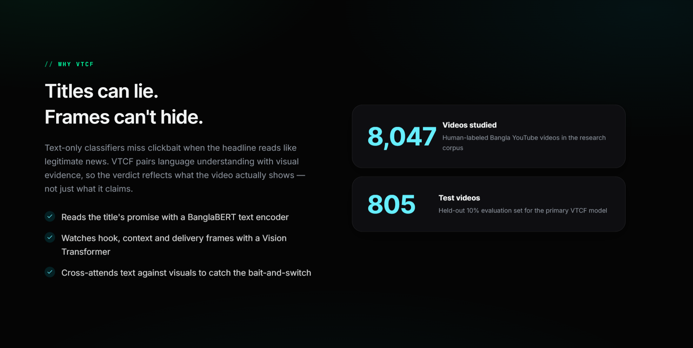

# VTCF — Bangla YouTube Clickbait Detector (Agent Console)

## Live prototype

**[vtcf-web-dashboard.vercel.app](https://vtcf-web-dashboard.vercel.app/)**

This is the deployed frontend, so you can explore the full UI — hero, hard-case carousel, alignment charts, TDS guide — without any local setup.

> ⚠️ **Live URL analysis is disabled on this deployment.** The backend requires GPU inference, multi-GB model checkpoints, and YouTube video downloads — none of which are practical to host on a free deployment tier. **The pre-cached hard cases and examples are fully interactive and load instantly** — this is the fastest way to see real results. For live analysis on a new YouTube URL, run the full stack locally (see Quick Start below).<br>


**Hackathon demo** for the [Visual-Temporal Contradiction Framework (VTCF)](https://github.com/KraKEn-bit/Multi-Modal-Clickbait-Analysis): a multimodal system that flags Bangla YouTube clickbait by comparing what the **title promises** with what the **video actually shows** — not title text alone.

> **This branch (`App_Version_2`)** is the dark, agent-console UI — staged live analysis, a hard-case carousel, and research charts. For the original landing-page UI, see the [`main`](https://github.com/KraKEn-bit/Multi-Modal-Clickbait-Analysis/tree/main/App) branch.

> **For judges — fastest path:** Open `http://localhost:3000`, scroll to **Hard cases**, and open one flagged `VTCF RESCUE`. That single result — a text-only baseline wrong, VTCF right — is the entire thesis of this project.

Part of: [Multi-Modal Clickbait Analysis](https://github.com/KraKEn-bit/Multi-Modal-Clickbait-Analysis)

---

## What problem does this solve?

Bangla YouTube clickbait often uses polished or sensational **headlines** while the **footage** tells a different story. Text-only classifiers — even strong ones like BanglaBERT — can be fooled when the title alone reads as legitimate.

**VTCF fuses three signals to catch what text alone misses:**
1. **Title text** — BanglaBERT reads the headline's promise
2. **Visual frames** — a Vision Transformer (ViT) reads the hook, context, and delivery moments of the video
3. **Cross-modal fusion** — cross-attention compares the title against the visuals to catch contradictions


---

## Demo walkthrough (recommended path for judges)

| Step | What to do | What you'll see |
|------|------------|-----------------|
| **1** | Open the landing page | Agent console hero, live "Analyze" input |
| **2** | Scroll to **Hard cases** | Carousel of rescued failures — title-only wrong, VTCF correct |
| **3** | Open a hard case | Side-by-side: title-only baseline vs. full VTCF, human ground truth shown |
| **4** | Review **Alignment over time** | Title↔frame alignment plotted across Hook → Context → Delivery |
| **5** | Review the **Temporal frames + TDS** | The actual Hook/Context/Delivery frames with the Temporal Divergence Score |
| **6** | Scroll to **Research findings** | Hard-case rescue rings and headline stats (8,047 videos, 805-video test set) |
| **7** | Open the **TDS guide** | Interactive explainer for what the score means and doesn't mean |
| **8** | (Optional) Paste a YouTube URL and click **Analyze** | Real download + inference on an unseen video, ~45–90s depending on length |


---

## Why text-only fails (the research behind this demo)


| Stat | Result | What it means |
|------|--------|----------------|
| **Full VTCF F1** | **99.63%** | On the held-out 805-video test set (10% of the 8,047-video corpus) |
| **Hard-case rescue** | **29 / 29** | Every text-blind hard case — where a well-written title fools a text-only model — was correctly rescued once visual evidence joined the decision |
| **Text-only F1** | 90.4% | Reading the title alone — strong on easy cases, blind to visual bait-and-switch |

---

## Temporal Divergence Score (TDS)


TDS (0–1) measures how much a video's **visuals change** across the hook, context, and delivery frames. It's shown alongside the frames and explanation as supporting evidence — **it is not a verdict by itself**.

**The counter-intuitive finding:** we expected clickbait to show a bigger visual shift (a classic bait-and-switch). The data said the opposite — clickbait videos average a **lower** TDS (~0.38) than genuine videos (~0.64), because clickbait often reuses the same static footage throughout rather than actually switching content.



---

## Quick start (run locally)

### Prerequisites

- Python 3.11+ · Node.js 18+ · [ffmpeg](https://ffmpeg.org/) on PATH
- Clone the **full parent repo** and check out this branch:

```bash
git clone https://github.com/KraKEn-bit/Multi-Modal-Clickbait-Analysis.git
cd Multi-Modal-Clickbait-Analysis
git checkout App_Version_2
```

**Link research code** (required once — the app imports `../vtcf-research`):

```powershell
# Windows
mklink /J vtcf-research VTCF-Finding-1
```

```bash
# macOS / Linux
ln -s VTCF-Finding-1 vtcf-research
```

**Model checkpoints (~2–3 GB, not included in this repo):** place trained weights at
`vtcf-research/outputs/checkpoints/best_model_full.pt`
**The pre-cached hard cases and examples work fully without any checkpoints.**

### Terminal 1 — Backend

```powershell
cd App\backend
python -m venv .venv
.\.venv\Scripts\Activate.ps1          # macOS/Linux: source .venv/bin/activate
pip install -r requirements.txt
python -m uvicorn main:app --host 127.0.0.1 --port 8000
```

### Terminal 2 — Frontend

```powershell
cd App\frontend
npm install
npm run dev
```

Open **http://localhost:3000**

Verify the API is running: `curl http://127.0.0.1:8000/health` → `{"status":"ok"}`

---

## What's new in this version

| Area | Change |
|------|--------|
| Hero | Agent console with staged, step-by-step live analysis |
| Hard cases | Carousel walkthrough — human label, both models' confidence, temporal frames |
| Charts | Alignment-over-time, TDS divergence curve, hard-case rescue rings |
| Theme | Dark agent aesthetic (`#050505`, agent green, cyber cyan) |

---

## Tech stack

| Layer | Stack |
|-------|-------|
| Text | BanglaBERT (`sagorsarker/bangla-bert-base`) |
| Vision | ViT (`google/vit-base-patch16-224`) |
| ML | PyTorch, Hugging Face Transformers |
| Video | yt-dlp, PySceneDetect, OpenCV, ffmpeg |
| Backend | FastAPI, Uvicorn |
| Frontend | Next.js 16, React 19, Tailwind CSS 4, Framer Motion, Anime.js |

---

## API endpoints

| Method | Path | Description |
|--------|------|-------------|
| `GET` | `/health` | Liveness check |
| `GET` | `/examples` | 4 pre-cached demo videos, load instantly |
| `POST` | `/analyze` | `{ "youtube_url": "..." }` — runs the full live pipeline |

---

## Cached demo videos

| Video | Label | Why it matters |
|-------|-------|----------------|
| `pYganyZsHYM` | Viral English bait | Sensational English headline, viral-style footage |
| `hcFpC8R6c24` | News bulletin | Straightforward genuine case — confirms VTCF doesn't over-trigger on real news |
| `OoUO4vjgM4c` | Hard case — **VTCF rescue** | BanglaBERT (title-only) → clickbait, wrong. VTCF → genuine, correct |
| `DhESX8gA7wk` | Hard case — **VTCF rescue** | BanglaBERT (title-only) → genuine, wrong. VTCF → clickbait, correct |

---

## Honest limitations

- Model checkpoints and the full frame cache aren't shipped in this repo (multi-GB scale) — download or retrain separately
- Live YouTube analysis may fail without valid browser cookies (YouTube rate-limits some automated downloads)
- The model samples 3 frames per video (hook, context, delivery), not full-video understanding
- Trained specifically on Bangla YouTube news-style content — may not generalize to other genres or languages
- A second, audio/summary-based model (Finding-2) was also researched but is **not** running live in this app — see [Related research](#related-research) below for why

---

## Project layout

```
App/
├── backend/              FastAPI + VTCF inference wrapper
│   └── cached_examples/  Pre-computed JSON + frame PNGs (demo works fully offline)
├── frontend/              Next.js agent-console UI (this version)
├── docs/screenshots/     Screenshots for this README (SS-1 … SS-7)
└── README.md
```

---

## Related research

- [VTCF Finding-1](../VTCF-Finding-1/) — the visual-text model powering this demo: baseline comparisons, ablations, full TDS analysis
- [VTCF Finding-2](../VTCF-finding-2/) — a separate audio/OCR/LLM-summary model, not used live in this app

Human labels sourced from **BaitBuster-Bangla**. This demo is not affiliated with YouTube and is a research/educational project, not a production content-moderation tool.

---

## Troubleshooting

| Issue | Fix |
|-------|-----|
| Example / hard cases won't load | Make sure the backend is running on port 8000 |
| Blank Hook / Context / Delivery frames | Confirm the backend is serving `/cached-frames/...` |
| `best_model_full.pt` not found | Only affects live URL analysis — cached hard cases work without it |
| `vtcf-research` not found / `No module named 'data'` | Create the symlink to `VTCF-Finding-1` next to `App/` (see Quick Start) |
| `No module named sklearn` | `pip install scikit-learn` inside the backend `.venv` |
