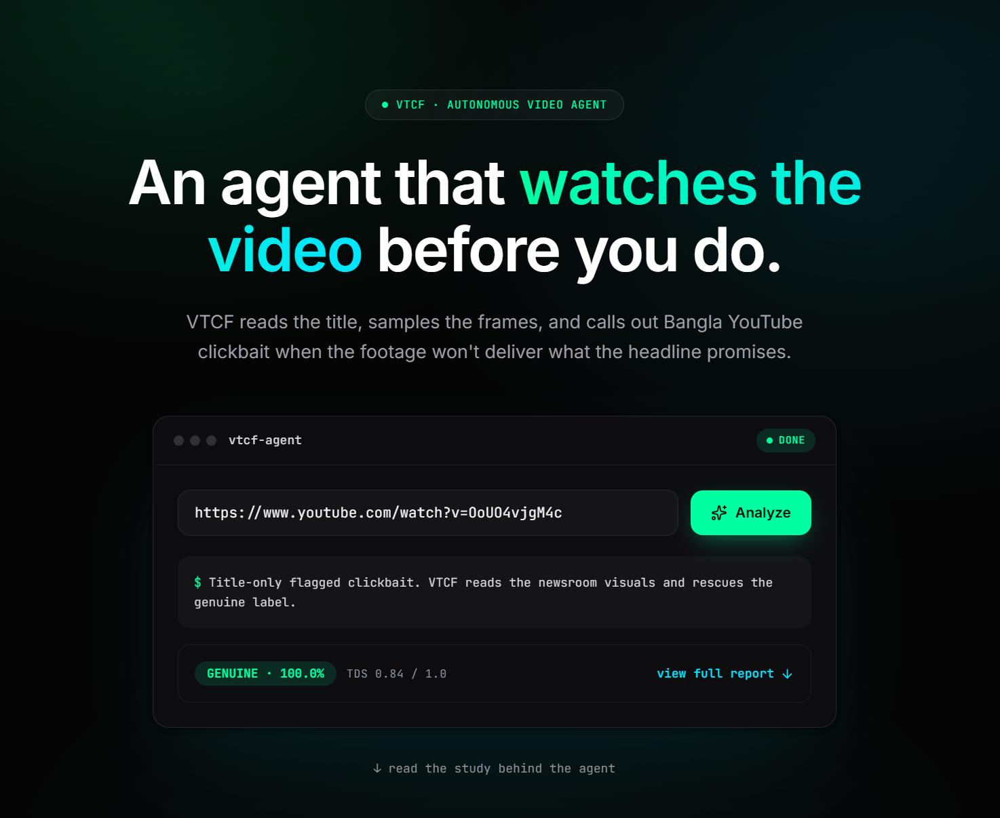
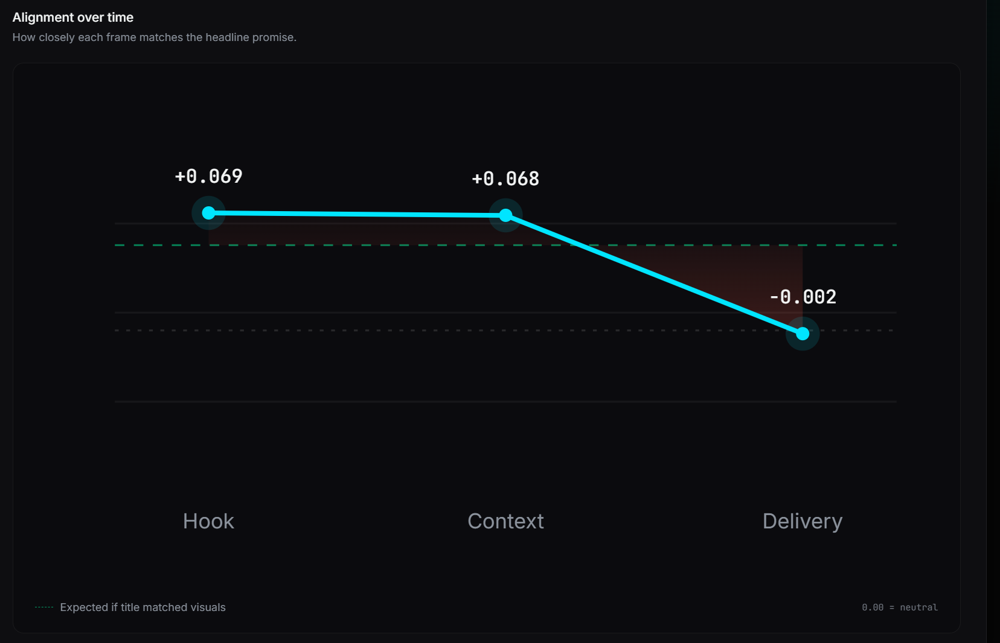
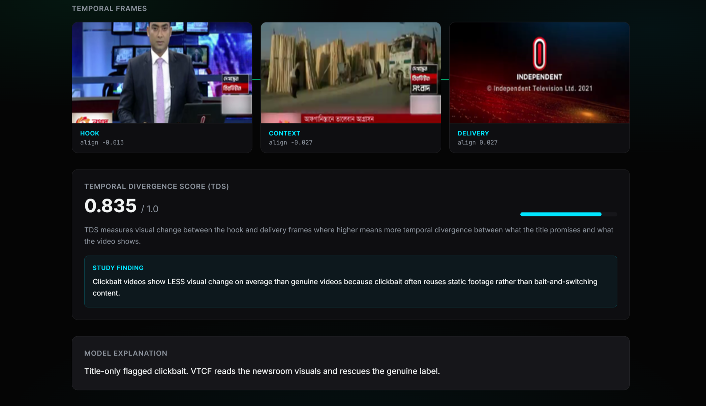
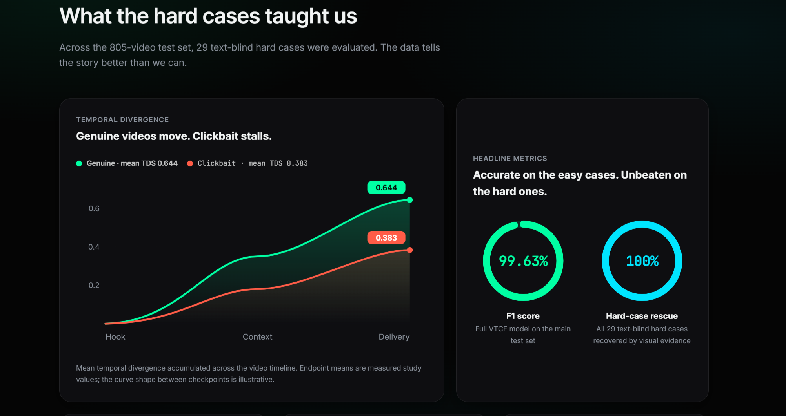
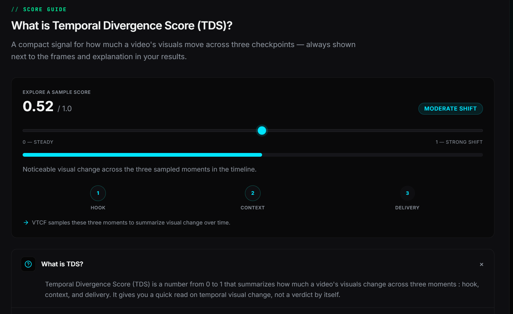

# VTCF : Bangla YouTube Clickbait Detector (App Version 2)

**Hackathon demo** for the [Visual-Temporal Contradiction Framework (VTCF)](https://github.com/KraKEn-bit/Multi-Modal-Clickbait-Analysis): a multimodal system that flags Bangla YouTube clickbait by comparing what the **title promises** with what the **video actually shows** — not title text alone.

> **This branch (`App_Version_2`)** is the **dark autonomous-agent UI** (agent console, hard-case carousel, research charts).  
> For the original landing UI, use the [`main`](https://github.com/KraKEn-bit/Multi-Modal-Clickbait-Analysis/tree/main/App) branch.

Part of: [Multi-Modal Clickbait Analysis](https://github.com/KraKEn-bit/Multi-Modal-Clickbait-Analysis)

---

## What problem does this solve?

Bangla YouTube clickbait often uses polished or sensational **headlines** while the **footage** tells a different story. Text-only classifiers (even strong ones like BanglaBERT) can miss this when the title alone looks legitimate.

**VTCF fuses:**
1. **Title text** — BanglaBERT reads the headline's promise  
2. **Visual frames** — ViT reads hook, context, and delivery moments  
3. **Cross-modal fusion** — cross-attention compares title against visuals to catch contradictions text alone misses  



---

## Demo walkthrough (recommended for judges)

| Step | What to do | What you'll see |
|------|------------|-----------------|
| **1** | Open the landing page | Dark agent console hero with live URL analyze |
| **2** | Scroll to **Hard cases** | Carousel of rescued failures (title-only wrong, VTCF correct) |
| **3** | Step through Hook → Context → Delivery | Temporal frames + alignment scores |
| **4** | Review **Alignment over time** | Chart of title↔frame alignment across the timeline |
| **5** | Open a hard case result / Judge Highlight | Side-by-side BanglaBERT miss vs VTCF rescue |
| **6** | Scroll to **Research findings** | TDS curves + F1 / hard-case rescue rings |
| **7** | (Optional) Paste a YouTube URL and click **Analyze** | Live download + inference (~45–90 s; needs cookies/checkpoints) |








---

## Why text-only fails (the research motivation)

| Stat | Result |
|------|--------|
| **Full VTCF F1** | **99.63%** on the held-out **805-video** test set (10% of the 8,047-video corpus) |
| **Hard-case rescue** | **29 / 29** — all text-blind hard cases recovered when visual evidence joined the decision |
| **Text-only F1** | 90.4% — misses visual bait-and-switch |

Open a case from the **805-video** test set on the landing page; the Research findings section highlights the **29** rescued hard cases.

---

## Temporal Divergence Score (TDS)

TDS (0–1) summarizes how much a video's **visuals change** across hook, context, and delivery. It is shown alongside frames and explanations — **not a verdict by itself**.

**Research surprise:** clickbait videos average **lower** TDS (~0.38) than genuine news (~0.64) — clickbait often reuses static footage rather than visually switching mid-video.



---

## Quick start (run locally)

### Prerequisites

- Python 3.11+ · Node.js 18+ · [ffmpeg](https://ffmpeg.org/) on PATH  
- Clone the **full parent repo** and check out this branch:

```bash
git clone https://github.com/KraKEn-bit/Multi-Modal-Clickbait-Analysis.git
cd Multi-Modal-Clickbait-Analysis
git checkout App_Version_2
```

**Link research code** (required once — app imports `../vtcf-research`):

```powershell
# Windows
mklink /J vtcf-research VTCF-Finding-1
```

```bash
# macOS / Linux
ln -s VTCF-Finding-1 vtcf-research
```

**Model checkpoints (~2–3 GB, not in GitHub):** place trained weights at  
`vtcf-research/outputs/checkpoints/best_model_full.pt`  
**Pre-cached example cards work without checkpoints.**

### Terminal 1 — Backend

```powershell
cd App\backend
python -m venv .venv
.\.venv\Scripts\Activate.ps1          # macOS/Linux: source .venv/bin/activate
pip install -r requirements.txt
python -m uvicorn main:app --host 127.0.0.1 --port 8000
```

### Terminal 2 — Frontend

```powershell
cd App\frontend
npm install
npm run dev
```

Open **http://localhost:3000**

Verify API: `curl http://127.0.0.1:8000/health` → `{"status":"ok"}`

---

## What's new in Version 2

| Area | Change |
|------|--------|
| Hero | Agent console (`vtcf-agent`) with staged analyze UX |
| Hard cases | Carousel walkthrough with human label, confidence clarity, frames |
| Charts | Alignment-over-time, TDS divergence, score rings |
| Theme | Dark agent aesthetic (`#050505`, agent green, cyber cyan) |

---

## Tech stack

| Layer | Stack |
|-------|-------|
| Text | BanglaBERT (`sagorsarker/bangla-bert-base`) |
| Vision | ViT (`google/vit-base-patch16-224`) |
| ML | PyTorch, Hugging Face Transformers |
| Video | yt-dlp, PySceneDetect, OpenCV, ffmpeg |
| Backend | FastAPI, Uvicorn |
| Frontend | Next.js 16, React 19, Tailwind CSS 4, Framer Motion, Anime.js |

---

## API endpoints

| Method | Path | Description |
|--------|------|-------------|
| `GET` | `/health` | Liveness |
| `GET` | `/examples` | 4 pre-cached demo videos (instant UI) |
| `POST` | `/analyze` | `{ "youtube_url": "..." }` — full pipeline |

---

## Cached demo videos

| Video | Label | Why it matters |
|-------|-------|----------------|
| `pYganyZsHYM` | Viral English bait | Sensational English headline |
| `hcFpC8R6c24` | News bulletin — false text alarm | Title-only over-triggers; VTCF confirms genuine |
| `OoUO4vjgM4c` | Hard / **VTCF rescue** | BanglaBERT → clickbait; VTCF → genuine |
| `DhESX8gA7wk` | Hard / **VTCF rescue** | BanglaBERT → genuine; VTCF → clickbait |

---

## Project layout

```
App/
├── backend/              FastAPI + VTCF inference wrapper
│   └── cached_examples/  Pre-computed JSON + frame PNGs
├── frontend/             Next.js agent UI (Version 2)
├── docs/screenshots/     Screenshots for this README (SS-1 … SS-6)
└── README.md
```

---

## Related research

- [VTCF Finding-1](../VTCF-Finding-1/) — visual-text baseline, ablations, TDS analysis  
- [VTCF Finding-2](../VTCF-finding-2/) — Bangla ASR + OCR + LLM summary fusion  

Human labels from **BaitBuster-Bangla**. Demo not affiliated with YouTube.

---

## Troubleshooting

| Issue | Fix |
|-------|-----|
| Example / frames won't load | Start backend on port 8000 |
| Blank Hook / Context / Delivery | Backend must serve `/cached-frames/...` |
| `best_model_full.pt` not found | Only affects live URL analysis; use cached hard cases |
| `vtcf-research` / `No module named 'data'` | Symlink research root next to `App/` (see Quick start) |
| `No module named sklearn` | `pip install scikit-learn` inside the backend `.venv` |
