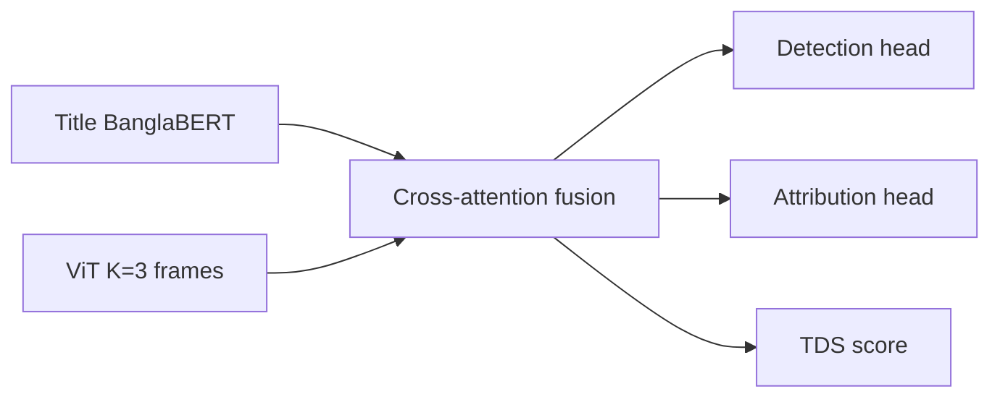

# VTCF Finding-1 — Visual-Temporal Contradiction Framework

Multimodal clickbait detection for **Bangla YouTube news** by fusing **title text (BanglaBERT)** with **temporal visual evidence (ViT)** across hook, context, and delivery frames.

Part of the [Multi-Modal Clickbait Analysis](https://github.com/KraKEn-bit/Multi-Modal-Clickbait-Analysis) research program. Finding-2 extends this with speech + OCR; Finding-1 is the visual-text baseline.

## Key idea

Clickbait titles often **contradict** what the video actually shows (bait-and-switch). VTCF learns:

1. **Detection** — clickbait vs. non-clickbait (binary)
2. **TDS (Title–Delivery Similarity)** — cosine similarity between title and visual delivery stream; lower TDS correlates with clickbait
3. **Attribution** — tactic labels (exaggeration, curiosity gap, etc.) via multi-task heads



## Results (test set ablation)

| Model | Accuracy | F1 (macro) | Notes |
|-------|----------|------------|-------|
| Text-Only (BanglaBERT) | 0.904 | 0.904 | McNemar p≈0 vs Full |
| Vision-Only (ViT) | 0.994 | 0.994 | Strong visual signal |
| **Full VTCF** | **0.995** | **0.995** | Best overall |
| VTCF on hard subset | — | **1.000** | Text confidence 0.45–0.55 |

**Ambiguous-text subset** (n=10): Text-Only F1 = 0.33 → VTCF F1 = 1.00 (**+0.67**).

**TDS analysis:** clickbait mean TDS = 0.38, non-clickbait = 0.64 (Mann–Whitney p ≈ 0).

See `outputs/evaluation_report.md`, `outputs/paper_results_table.txt`, and `outputs/hard_subset_results.json`.

## What is included (space-conscious)

| Included | Excluded |
|----------|----------|
| Full training/eval/inference code | 3 GB full VTCF checkpoints (train locally) |
| `verified_live_videos.csv` (~10k live/dead audit) | Raw BaitBuster parquet/xlsx (~255 MB) |
| Text-only baseline weights (~8 MB) | YouTube cookies |
| Sample frames (6 videos × 3 frames) | Full frame cache (~1.3 GB, 8k videos) |
| Paper figures & Grad-CAM visualizations | `input_videos.csv` (29 MB) |
| Kaggle reproduction notebooks | Local video cache |

**Repo size:** ~15–20 MB.

## Models

| Component | Source |
|-----------|--------|
| Text encoder | [`sagorsarker/bangla-bert-base`](https://huggingface.co/sagorsarker/bangla-bert-base) |
| Vision encoder | [`google/vit-base-patch16-224`](https://huggingface.co/google/vit-base-patch16-224) |
| Text-only baseline | `data/baseline_banglabert_model/` (bundled) |
| Full VTCF weights | Train with `scripts/train.py` → `outputs/checkpoints/best_model_full.pt` |

## Prerequisites

- **Python 3.11 or 3.12** (torch 2.3 wheels)
- [ffmpeg](https://ffmpeg.org/) on PATH (for `yt-dlp` + PySceneDetect)

## Setup

```bash
cd VTCF-Finding-1
python -m venv .venv
# Windows
.venv\Scripts\activate
pip install -r requirements.txt
```

## Quick start

### 1. Inspect verified dataset

```bash
python scripts/check_rows.py
```

`data/verified_live_videos.csv` — 10,000 videos with human labels, TDS scores, and frame paths (`audit_status`: live/dead).

### 2. Train (requires full frame cache locally)

```bash
python scripts/train.py --mode full          # Full VTCF
python scripts/train.py --mode text_only     # BanglaBERT ablation
python scripts/train.py --mode vision_only   # ViT ablation
```

Checkpoints save to `outputs/checkpoints/`.

### 3. Evaluate

```bash
python scripts/evaluate.py
```

Generates ablation comparison, McNemar tests, and TDS correlation stats.

### 4. Predict on a single video (needs frames)

```bash
python scripts/predict.py --video-id HPa6mRwjUg8
```

### 5. Regenerate paper figures

```bash
python scripts/generate_figures.py
```

## Sample frames

Six annotated examples under `data/sample_frames/` (hook / context / delivery):

| Video ID | Label | Role |
|----------|-------|------|
| `HPa6mRwjUg8` | clickbait | Example prediction + attention viz |
| `K0lGoBXk3LQ` | clickbait | Correct detection figure |
| `Ef6fc3XuZ0A` | non-clickbait | Correct detection figure |
| `vsFWrL2YUfE` | clickbait | Hard-subset rescue (text failed, VTCF correct) |
| `bwkR5p0VY7Y` | clickbait | High-TDS contrast |
| `rwxsUpXAozk` | clickbait | Standard news thumbnail |

Full frames for all ~8k live videos are produced by `data/ingestion.py` (not shipped in this repo).

## Project layout

```
VTCF-Finding-1/
├── config.yaml
├── requirements.txt
├── data/
│   ├── custom_dataset.py       # PyTorch Dataset & splits
│   ├── ingestion.py            # yt-dlp + scene-detect pipeline
│   ├── verified_live_videos.csv
│   ├── baseline_banglabert_model/
│   └── sample_frames/          # 6 demo videos
├── models/
│   ├── fusion_network.py       # VTCF architecture + loss
│   └── interpretability.py     # Captum attributions
├── scripts/
│   ├── train.py
│   ├── evaluate.py
│   ├── predict.py
│   └── generate_figures.py
├── outputs/
│   ├── evaluation_report.md
│   ├── paper_results_table.txt
│   ├── hard_subset_results.json
│   └── visualizations/         # Paper + Grad-CAM figures
└── Kaggle_notebook/            # Cloud reproduction
```

## Data provenance

Human clickbait labels originate from **BaitBuster-Bangla**. The verified CSV filters to videos with successful frame extraction (`audit_status == live`). Raw annotation files are not included; contact the authors or use the Kaggle notebook for full reproduction.

## Citation

If you use this work, cite the Multi-Modal Clickbait Analysis repository and the VTCF Finding-1 baseline. Finding-2 builds on this codebase for speech/OCR modality extension.

## Related

- [VTCF Finding-2](../VTCF-finding-2/) — Bangla ASR + hook OCR + LLM summary fusion
