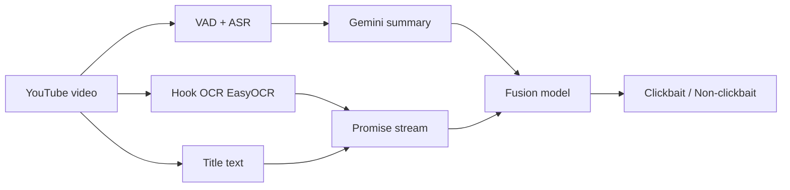

# VTCF Finding-2 — Semantic Speech + OCR Modality for Bangla Clickbait Detection

Feasibility study extending **Visual-Text Clickbait Fusion (VTCF)** with a second modality: **Bangla ASR transcripts**, **hook-frame OCR**, and **LLM delivery summaries**, fused with video titles for clickbait classification.

This folder is a **standalone showcase** of the research pipeline. Pre-trained weights are pulled from Hugging Face at runtime (not stored in-repo to save space).

## Research question

Can speech content and on-screen hook text add signal beyond title-only clickbait detection for Bangla YouTube news?

**Ground truth:** human labels from BaitBuster-Bangla (never overwritten).  
**Diagnostic only:** `semantic_divergence` (title vs. delivery summary cosine distance) — not used as a classifier.

## Pipeline overview



| Phase | Script | Status |
|-------|--------|--------|
| **0 — Spike** | `scripts/phase0_spike.py` | Done — 50/50 stratified sample, GO decision |
| **1 — Scale-up** | `scripts/phase1_extract.py` | In progress — see `outputs/status/phase1_progress.json` |
| **2 — Dataset** | `data/custom_dataset.py` | PyTorch loader + smoke test ready |
| **3 — Train** | `models/fusion_network_v2.py` | Pending full dataset |

## What is included (space-conscious)

| Included | Excluded (regenerate locally) |
|----------|-------------------------------|
| All Python scripts + PowerShell helpers | `.env`, API keys |
| `config.yaml`, `requirements.txt` | Audio/video files (`*.wav`, `*.mp4`) |
| Phase 0 spike list + full spike transcripts | Raw ASR text (`raw_transcript.txt`) |
| `finding2_verified.csv` metadata (~1.4k rows) | Hugging Face model weights (auto-download) |
| LLM summaries + metadata per video | Full run logs |
| ASR benchmark winner + Phase 0 results | Parent `vtcf-research` frames/cookies |

**Repo size:** ~4–5 MB (text artifacts only).

## Models (Hugging Face — downloaded on first run)

| Component | Model |
|-----------|-------|
| ASR (winner) | [`bengaliAI/tugstugi_bengaliai-regional-asr_whisper-medium`](https://huggingface.co/bengaliAI/tugstugi_bengaliai-regional-asr_whisper-medium) |
| Text encoder | [`sagorsarker/bangla-bert-base`](https://huggingface.co/sagorsarker/bangla-bert-base) |
| Summarization | Google Gemini (API key required) |

See `outputs/asr_benchmark/winner.json` for the ASR selection rationale.

## Quick start

### 1. Environment

```bash
cd VTCF-finding-2
python -m venv .venv
# Windows
.venv\Scripts\activate
pip install -r requirements.txt
```

Create `.env` in this folder:

```env
GEMINI_API_KEY=your_key_here
```

### 2. Phase 0 spike (optional re-run)

Requires read-only access to sibling `vtcf-research/` (verified CSV + extracted frames + YouTube cookies). Adjust paths in `config.yaml` if needed.

```bash
python scripts/phase0_spike.py
```

Results land in `outputs/spike_results/spike_summary.csv`.

### 3. Phase 2 dataset smoke test

Uses bundled `data/finding2_verified.csv` + `data/transcripts/*/summary.txt`:

```bash
python scripts/smoke_dataset.py
```

### 4. Phase 1 full extraction (local only)

```bash
python scripts/phase1_extract.py --resume
# Or resilient runner (Windows):
powershell -ExecutionPolicy Bypass -File scripts/run_phase1_resilient.ps1
```

## Key results (Phase 0)

- **ASR coverage:** ~95%+ speech coverage on spike sample (VAD montage, Demucs off).
- **Hook OCR gate:** Most Bangla news thumbnails use title-only promises; ~3/50 passed usable OCR.
- **Semantic divergence:** Mean ~0.38; weak/inverted correlation with clickbait label — not used for classification.
- **Decision:** Proceed to Phase 1 scale-up and fusion training.

Check `outputs/spike_results/spike_summary.csv` for per-video transcripts, summaries, and diagnostics.

## Fusion architecture

`models/fusion_network_v2.py` implements **TextStreamFusion**:

- Three BanglaBERT-encoded streams: **title**, **hook OCR**, **delivery summary**
- Cross-attention: title→OCR, OCR→summary
- Gated fusion → binary clickbait head

Raw ASR is used for audit/summarization only; the trainable model sees title + OCR + summary.

## Project layout

```
VTCF-finding-2/
├── config.yaml
├── requirements.txt
├── data/
│   ├── custom_dataset.py
│   ├── spike_videos.csv
│   ├── finding2_subset.csv
│   ├── finding2_verified.csv
│   ├── llm_call_log.csv
│   ├── spike_transcripts/
│   └── transcripts/
├── models/
│   └── fusion_network_v2.py
├── outputs/
│   ├── asr_benchmark/winner.json
│   ├── spike_results/spike_summary.csv
│   └── status/phase1_progress.json
└── scripts/
    ├── phase0_spike.py
    ├── phase1_extract.py
    ├── semantic_features.py
    ├── extract_speech.py
    └── smoke_dataset.py
```

## Citation & context

Part of the **Multi-Modal Clickbait Analysis** research program ([parent repo](https://github.com/KraKEn-bit/Multi-Modal-Clickbait-Analysis)). Finding-1 covers the visual-text baseline; Finding-2 tests whether spoken delivery contradicts sensational titles in Bangla YouTube news.
